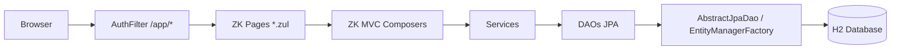

# ARCHITECTURE

## 1. Objetivo

Descrever a arquitetura atual do `censo-superior-webapp` (v2.0.0), um monolito Java 6 em camadas com frontend ZK 3.6.2 no padrao MVC.

Modulos:
1. `Aluno` (Registro 41)
2. `Curso` (Registro 21)
3. `CursoAluno` (Registro 42)
4. `Docente` (Registro 31)
5. `IES` (Registro 11 - laboratorio)

## 2. Visao arquitetural

A arquitetura segue camadas com responsabilidade explicita:

1. `web/zk`: composers MVC e paginas `.zul`.
2. `web/filter`: seguranca de acesso a `/app/*`.
3. `service`: regras de negocio, validacoes e import/export TXT pipe.
4. `dao`: persistencia JPA (`EntityManager`, `EntityTransaction`).
5. `model`: entidades e enums de dominio.
6. `util`: utilitarios transversais.



## 3. Estrutura de componentes

| Camada | Pacote principal | Responsabilidade | Exemplos |
| --- | --- | --- | --- |
| Web ZK | `br.gov.inep.censo.web.zk` | Controllers MVC de tela | `LoginComposer`, `HomeComposer`, `MenuComposer`, `DashboardComposer`, `AlunoComposer`, `CursoComposer`, `CursoAlunoComposer`, `DocenteComposer`, `IesComposer` |
| Filtro | `br.gov.inep.censo.web.filter` | Protecao de rotas autenticadas | `AuthFilter` |
| Service | `br.gov.inep.censo.service` | Regra de negocio e orquestracao | `AlunoService`, `CursoService`, `CursoAlunoService`, `DocenteService`, `IesService`, `AuthService` |
| DAO | `br.gov.inep.censo.dao` | CRUD e consulta com JPA | `AlunoDAO`, `CursoDAO`, `CursoAlunoDAO`, `DocenteDAO`, `IesDAO`, `MunicipioDAO` |
| Modelo | `br.gov.inep.censo.model` | Entidades persistidas | `Aluno`, `Curso`, `CursoAluno`, `Docente`, `Ies`, `Municipio`, `Usuario` |
| Dominio auxiliar | `br.gov.inep.censo.domain` | Constantes de dominio/layout | `CategoriasOpcao`, `ModulosLayout` |
| Utilitarios | `br.gov.inep.censo.util` | Apoio reutilizavel | `ValidationUtils`, `PasswordUtil`, `RequestFieldMapper` |
| Configuracao | `br.gov.inep.censo.config` | Bootstrap e infraestrutura de banco | `ConnectionFactory`, `HibernateConnectionProvider`, `DatabaseBootstrapListener` |

## 4. Frontend ZK 2.0.0

### 4.1 Shell autenticado

- arquivo: `src/main/webapp/app/menu.zul`
- layout: `header + sidebar + center + footer`
- `center` usa `<include id="incMain"/>` para tela principal
- sub-window modal usa `<include id="incSub"/>` para cadastro/visualizacao

### 4.2 Contrato de navegacao

- `view` define a tela principal (`dashboard`, `aluno-list`, `curso-list`, `curso-aluno-list`, `docente-list`, `ies-list`)
- `sub` define modal (`aluno-form`, `aluno-view`, `curso-form`, `curso-view`, `curso-aluno-form`, `docente-form`, `docente-view`, `ies-form`, `ies-view`)
- `id` carrega registro para alteracao/visualizacao

Exemplos:
1. `/app/menu.zul?view=dashboard`
2. `/app/menu.zul?view=aluno-list`
3. `/app/menu.zul?view=aluno-list&sub=aluno-form&id=10`

### 4.3 Autenticacao

1. Usuario acessa `login.zul`.
2. `LoginComposer` autentica via `AuthService`.
3. Sessao HTTP recebe `usuarioLogado`.
4. `AuthFilter` protege `/app/*` e redireciona para `/login.zul` sem sessao.

## 5. Persistencia e modelo de dados

Tabelas centrais:
1. `usuario`
2. `aluno` (Registro 41)
3. `curso` (Registro 21)
4. `curso_aluno` (Registro 42)
5. `docente` (Registro 31)
6. `ies` (Registro 11)
7. `municipio`

Tabelas auxiliares:
1. `dominio_opcao`
2. `aluno_opcao`
3. `curso_opcao`
4. `curso_aluno_opcao`
5. `layout_campo`
6. `aluno_layout_valor`
7. `curso_layout_valor`
8. `curso_aluno_layout_valor`
9. `docente_layout_valor`
10. `ies_layout_valor`

Scripts:
1. `src/main/resources/db/schema.sql`
2. `src/main/resources/db/seed.sql`
3. `src/main/resources/db/seed_layout.sql`
4. `src/main/resources/db/seed_layout_ies_docente.sql`
5. `src/main/resources/db/seed_municipio.sql`

## 6. Decisoes arquiteturais

1. Hibernate 4.2 + JPA (`javax.persistence`) para manter compatibilidade Java 6.
2. Frontend unificado em ZK 3.6.2 MVC, removendo JSP/servlets de tela.
3. Navegacao por shell unico com includes (`incMain`/`incSub`) para reduzir acoplamento de rotas.
4. Camadas `service` e `dao` mantidas para isolamento de regra de negocio e persistencia.
5. Builder Pattern nas entidades principais para reduzir acoplamento de construcao.
6. Metadados de leiaute (`layout_campo`) para suportar evolucao de campos sem alterar modelo central.

## 7. Qualidade, build e testes

Build:
```bash
mvn clean package
```

Em JDK moderno:
```bash
mvn '-Dmaven.compiler.source=1.7' '-Dmaven.compiler.target=1.7' test
```

Qualidade:
1. JaCoCo com gate minimo de 80% de cobertura de linha.
2. Escopo do gate: `dao`, `service` e `util`.
3. E2E mantido como `@Ignore` por padrao.

## 8. Restricoes e riscos

1. Stack legado (Servlet 2.5, Java 6) limita upgrades de bibliotecas.
2. Mudancas de schema exigem alinhamento entre DAO/Service/Testes.
3. Import/export depende de metadados corretos do leiaute oficial.
4. Pool interno do Hibernate e adequado para desenvolvimento, nao para producao.

## 9. Referencias

1. `README.md`
2. `docs/TEST-PLAN.md`
3. `docs/HIBERNATE-MIGRATION.md`
4. `src/main/java/br/gov/inep/censo/web/zk`
5. `src/main/webapp/WEB-INF/zk.xml`
6. `src/main/webapp/app/menu.zul`
