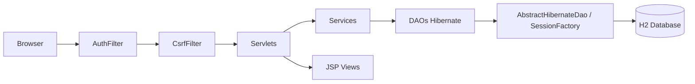

# ARCHITECTURE

## 1. Objetivo

Descrever a arquitetura do `censo-superior-webapp`, um monolito web Java 6 para cadastro e processamento dos registros do Censo Superior.

Modulos atuais:

1. `Aluno` (Registro 41)
2. `Curso` (Registro 21)
3. `CursoAluno` (Registro 42)
4. `Docente` (Registro 31)
5. `IES` (Registro 11 - laboratorio)

## 2. Visao Arquitetural

O sistema segue arquitetura em camadas com separacao clara de responsabilidades:

1. `web`: entrada HTTP, navegacao e renderizacao JSP.
2. `service`: regras de negocio, validacoes e import/export TXT pipe.
3. `dao`: persistencia Hibernate nativa (`Session`/`Transaction`) com HQL e SQL nativo quando necessario.
4. `model`: entidades e enums de dominio.
5. `util`: utilitarios transversais (hash, validacoes, mapeamento).



## 3. Estrutura de Componentes

| Camada | Pacote principal | Responsabilidade | Exemplos |
| --- | --- | --- | --- |
| Web | `br.gov.inep.censo.web` | Controller HTTP e roteamento | `AbstractActionServlet`, `AlunoServlet`, `CursoServlet`, `CursoAlunoServlet`, `DocenteServlet`, `IesServlet` |
| Filtro | `br.gov.inep.censo.web.filter` | Protecao de rotas autenticadas e anti-CSRF | `AuthFilter`, `CsrfFilter` |
| Service | `br.gov.inep.censo.service` | Regra de negocio e orquestracao | `AlunoService`, `CursoService`, `CursoAlunoService`, `DocenteService`, `IesService` |
| DAO | `br.gov.inep.censo.dao` | CRUD, transacao e consulta com Hibernate nativo | `AlunoDAO`, `CursoDAO`, `CursoAlunoDAO`, `DocenteDAO`, `IesDAO`, `MunicipioDAO` |
| Modelo | `br.gov.inep.censo.model` | Entidades persistidas | `Aluno`, `Curso`, `CursoAluno`, `Docente`, `Ies`, `Municipio`, `Usuario` |
| Dominio auxiliar | `br.gov.inep.censo.domain` | Constantes de dominio/layout | `CategoriasOpcao`, `ModulosLayout` |
| Utilitarios | `br.gov.inep.censo.util` | Funcoes de apoio reutilizaveis | `ValidationUtils`, `PasswordUtil`, `RequestFieldMapper` |
| Configuracao | `br.gov.inep.censo.config` | Infra de banco, bootstrap e persistencia | `ConnectionFactory`, `HibernateConnectionProvider`, `DatabaseBootstrapListener` |

## 4. Fluxos Principais

### 4.1 Autenticacao

1. Usuario acessa `login.jsp`.
2. `LoginServlet` valida credencial via `AuthService`.
3. Senha e validada por `PasswordUtil` com formato PBKDF2 (`PBKDF2$iter$salt$hash`) e compatibilidade com hash legado SHA-256.
4. Em login bem-sucedido com hash legado, o sistema faz upgrade transparente para PBKDF2.
5. Sessao HTTP recebe `usuarioLogado`.
6. `AuthFilter` protege `/app/*` e redireciona sem sessao.
7. `CsrfFilter` valida token para requisicoes `POST` em `/app/*`.

### 4.2 Operacoes de modulo

1. Servlet recebe acao (`lista`, `form`, `salvar`, `mostrar`, `excluir`, `importar`, `exportar`).
2. `AbstractActionServlet` despacha a acao para comando registrado (`Map<String, ActionCommand>`).
3. Service valida regras e consistencia.
4. DAO executa operacoes em `Session` Hibernate (HQL e SQL nativo para tabelas auxiliares).
5. JSP renderiza saida com escape HTML via `ViewUtils.e(...)`.
6. Servlet encaminha para JSP de lista, formulario ou visualizacao.

Observacao: `CursoAluno` foi separado em `curso-aluno-list.jsp` e `curso-aluno-form.jsp` para melhorar legibilidade.

### 4.3 Importacao e exportacao TXT pipe

1. Entrada no formato pipe (`|`).
2. Services fazem parse e mapeamento por registro (`11`, `21`, `31`, `41`, `42`).
3. Persistencia cobre campos fixos e complementares de layout.
4. Exportacao gera TXT individual ou em lote.
5. Registro `10` pode ser usado como cabecalho no fluxo de importacao de `IES`.

## 5. Persistencia e Modelo de Dados

Tabelas centrais:

1. `usuario`
2. `aluno` (Registro 41)
3. `curso` (Registro 21)
4. `curso_aluno` (Registro 42)
5. `docente` (Registro 31)
6. `ies` (Registro 11)
7. `municipio` (tabela de apoio)

Tabelas auxiliares:

1. `dominio_opcao`
2. `aluno_opcao`
3. `curso_opcao`
4. `curso_aluno_opcao`
5. `layout_campo`
6. `aluno_layout_valor`
7. `curso_layout_valor`
8. `curso_aluno_layout_valor`
9. `docente_layout_valor`
10. `ies_layout_valor`

Scripts de banco:

1. `src/main/resources/db/schema.sql`
2. `src/main/resources/db/seed.sql`
3. `src/main/resources/db/seed_layout.sql`
4. `src/main/resources/db/seed_layout_ies_docente.sql`
5. `src/main/resources/db/seed_municipio.sql`

## 6. Decisoes Arquiteturais Relevantes

1. Hibernate 4.2 (compativel com Java 6) adotado como base de persistencia com entidades anotadas em JPA (`javax.persistence`).
2. Mapeamento ORM por classes anotadas (`hibernate.cfg.xml` + `mapping class`) para manter contrato Java 6 e reduzir dependencia de XML separado.
3. Monolito em camadas para simplicidade de manutencao em stack legado.
4. Modelagem de campos de layout por metadados para suportar evolucao de leiaute.
5. Sessao HTTP + filtro para autenticacao sem dependencia externa.
6. Tabela de apoio `municipio` para validar consistencia de UF/codigo de municipio em `Docente` e `IES`.
7. Builder Pattern para construcao de entidades com muitos campos de formulario (`Aluno`, `Curso`, `CursoAluno`, `Docente`, `Ies`).
8. Camada `web` consumindo `service` para acesso a dados de tela, evitando dependencia direta de DAO.
9. Synchronizer Token Pattern para CSRF em operacoes mutaveis de `/app/*`.
10. Output Encoding centralizado com `ViewUtils.e(...)` para mitigar XSS refletido/armazenado em JSP.
11. Migracao progressiva de hash de senha: compatibilidade legado + rehash automatico para PBKDF2.
12. Command Pattern no web layer para despacho de `acao` sem cadeias extensas de `if/else`.
13. JPA annotations (`@Entity`, `@Table`, `@Column`) adotadas sem migrar os DAOs para `EntityManager`, mantendo baseline Hibernate nativo na camada DAO.

## 7. Qualidade, Build e Testes

Build:

```bash
mvn clean package
```

Testes (workspace atual):

```bash
mvn -Dmaven.repo.local=.m2/repository -Dmaven.compiler.source=1.7 -Dmaven.compiler.target=1.7 test
```

Qualidade:

1. JaCoCo com gate minimo de 80% de cobertura de linha.
2. Escopo do gate: pacotes `dao`, `service` e `util`.
3. Suite com testes unitarios, integracao e E2E (E2E desativado por padrao).

## 8. Restricoes e Riscos

1. Stack legado (Servlet 2.5, JSP 2.1, Java 6) limita uso de recursos modernos.
2. Mudancas de schema exigem sincronizacao entre mapeamentos Hibernate, DAO, service e testes.
3. Acoplamento entre importacao/exportacao e metadados de layout exige regressao cuidadosa.
4. Seguranca depende de manter `ViewUtils.e(...)` em toda saida JSP e `_csrf` em todo `POST` de `/app/*`.
5. Pool embutido do Hibernate e adequado para desenvolvimento, mas nao para producao.

## 9. Referencias no repositorio

1. `README.md`
2. `docs/TEST-PLAN.md`
3. `docs/HIBERNATE-MIGRATION.md`
4. `docs/HIBERNATE-NATIVE-WHAT-CHANGED.md`
5. `src/main/java/br/gov/inep/censo/web`
6. `src/main/java/br/gov/inep/censo/service`
7. `src/main/java/br/gov/inep/censo/dao`
8. `src/main/java/br/gov/inep/censo/config`
9. `src/main/resources/db`
